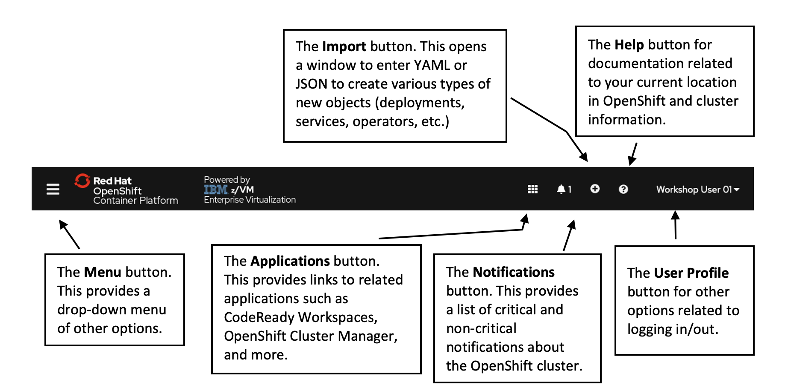

# The Administrator Perspective

!!! Important
    Work in Progress

Take a moment to notice the following elements in the navigation bar:

!!! Note
    These buttons display on each page of the OpenShift console. Note that the Applications button might be missing from your screen, depending on your credentials.

By default, the menu on the left side of the page should be activated and displaying the cluster menu.

1. In the left-side menu, **select the Administrator perspective** if it isn't already showing.

    

    With the administrator menu showing, you are provided with a broad range of options to manage the OpenShift cluster and the applications running on it.

    

    * *Developer / Administrator toggle*.  This lets you flip between which of the two perspectives you want to use.

    * *Home*: Provides overview of projects, resources, and events in the scope of your credentials.

    * *Operators*: Provides access to the OperatorHub to install new operators and also lets you view operators that are already installed.

    * *Workloads*: Expands to provide access to many Kubernetes and OpenShift objects, such as pods, deployments, secrets, jobs and more.

    * *Networking*: Provides access to services, routes, and ingresses required for external access to the cluster.

    * *Storage*: Provides access to storage objects in the OpenShift cluster, such as PersistentVolumeClaims.

    * *Builds*: View and create Build objects – use to transform input parameters into resulting objects.

    * *Pipelines*: View and create Pipelines – Tekton-based CI/CD processes and objects. This will be missing if not installed in your OpenShift cluster.

    * *Monitoring*: Access cluster resource Monitoring, Metrics, and Alerting.

    * *Compute*: Access cluster infrastructure – Control & Compute Nodes, Machines, and more.

    * *User Management*: Access and manage Users, Groups, Roles, RoleBindings, Service Accounts, and more.

    * *Administration*: View and edit cluster settings.

    The *Administrator* perspective is the default view for the OpenShift console for users who have an administrative access level. This perspective provides visibility into options related to cluster administration, as well as a broader view of the projects associated with the currently logged-in user.

1. In the Menu, **click Home -> Projects**.

    

    The rest of the page is populated by projects. A project has been created for you to work in named userNN-project (where NN is your user number).
    
    !!! Note
        Any project starting with *openshift-* or *kube-* contain the workloads running the OpenShift platform itself.

1. **Click the userNN-project hyperlink** (where NN is your user number).

    !!! Tip
        With so many Projects displayed, you can use the search bar to find yours more easily.

    You will now see the Dashboard for your project.

    

    **Scroll down the Overview tab of your project**. This displays information about what’s going on in your project, such as CPU and memory usage, any alerts or crashlooping pods, an inventory of all the Kubernetes resources deployed in the project, and more. You won’t see much information yet, as no workloads should be running in this project.
    
    **Click the Workloads tab** to the right of YAML. This page displays all of the workloads in your project, so it’s empty for now.

    !!! Note
        All objects in OpenShift are generated using YAML files. YAML (standing for Yet Another Markup Language) is meant to be a human-readable language for configuration files. Any OpenShift object such as Deployments, Services, Routes, and nearly everything else can be modified by directly editing their YAML file in either the console or command line.

    Workloads are typically created by developers, so in the next section, you will swap to the developer perspective to deploy a an application. You will return to the administrator perspective later in this lab.
