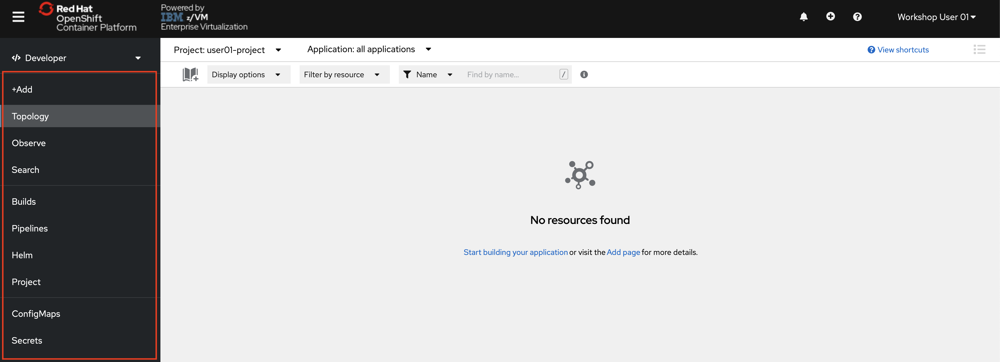
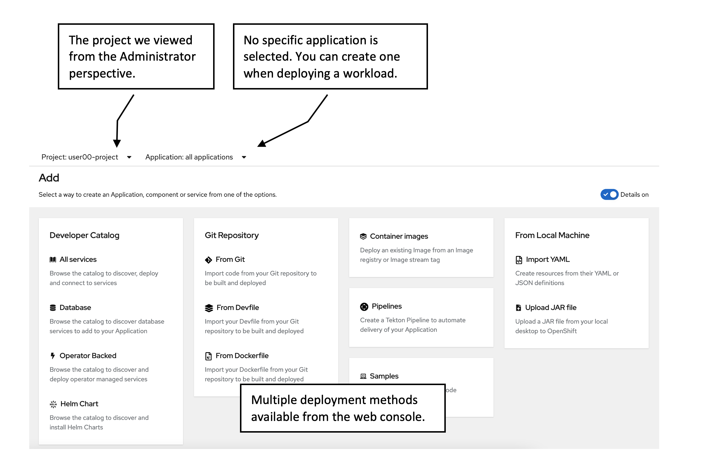

# The Developer Perspective

!!! Important
    Work in Progress

1. In the left-side Menu, **click the Administrator dropdown, and select Developer**.

    

    The *Developer* perspective provides views and workflows specific to developer use cases, while hiding many of the cluster management options typically used by administrators. This perspective provides developers with a streamlined view of the options they typically use.

    

    ??? Information "Expand to Learn More About the Different Views"
        * *+Add*: Clicking on this will open a prompt letting you add a workload to your current project.

        * *Topology*: Displays all of the deployed workloads in the currently selected project.

        * *Monitoring*: Lets you view the monitoring dashboard for just this project.

        * *Search*: Used to search for any type of API resource present in this project, provided you have access to that resource type.

        * *Builds*: This will let you view or create Build Configurations in the currently selected project.

        * *Pipelines*: View and create Pipelines – Tekton-based CI/CD processes and objects.

        * *Helm*: Displays the Helm releases in this project, or prompts you to install one from the catalog if none are present.

        * *Project*: Takes you to your project overview page, the project inventory, events, utilization, and more.

        * *Config Maps*: Displays Config Maps for your project, which store non-confidential data in key-value pairs.

        * *Secrets*: Displays Secrets for your project. Used to store sensitive, confidential data in key-value pairs, tokens, or passwords.

Switching to the Developer perspective takes you to the *Topology* view. If no workloads are deployed in the selected project, options to deploy a workload are displayed.

1. If this isn't the case, **click the +Add button in the menu**.

    

    ??? Information "Expand to learn about Deployment Methods"
        There are multiple methods of deploying workloads from the OpenShift web browser.

        * *Samples*: Red Hat provides sample applications in various languages. Use these to see what a pre-made application running in OpenShift can look like.
        * *From Git*: Use this option to import an existing codebase in a Git repository to create, build, and deploy an application.
        * *From Devfile*: Similar to From Git, use this option to import a Devfile from your Git repository to build and deploy an application.
        * *Container Image*: Use existing images from an image stream or registry to deploy it.
        * *From Catalog*: Explore the Developer Catalog to select the required applications, services, or source to image builders and add it to your project.
        * *From Dockerfile*: Import a dockerfile from your Git repository to build and deploy an application.
        * *YAML*: Use the editor to add YAML or JSON definitions to create and modify resources.
        * *Database*: Filters the Developer Catalog to display only the databases it contains.
        * *Operator Backed*: Deploy applications that are managed by Operators. Many of these will come from the OperatorHub.
        * *Helm Chart*: Deploy applications defined by Helm Charts, which provide simple installations, upgrades, rollbacks, and generally reduced complexity.
        * *Pipeline*: Create a Tekton-based Pipeline to automate application creation and delivery using OpenShift’s built-in CI/CD capabilities.

    In the next section, you will deploy an application from the OpenShift Developer Catalog.
