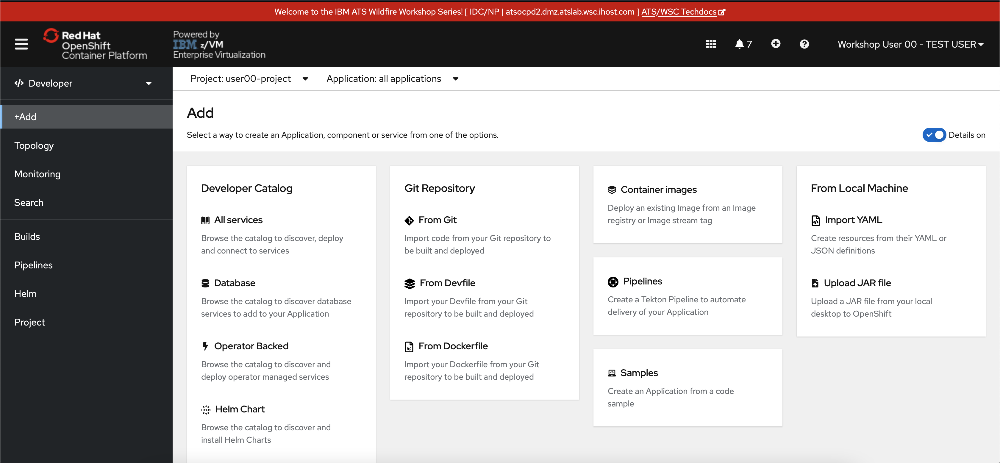
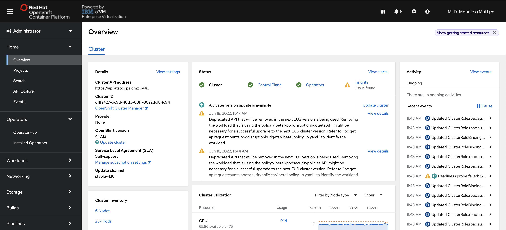

# Exploring the OpenShift Console

The OpenShift Container Platform web console is a user interface accessible from a web browser.

Developers can use the web console to [visualize, browse, and manage the contents of projects](https://docs.openshift.com/container-platform/4.8/web_console/odc-about-developer-perspective.html).

Administrators can use the web console to monitor the status of the applications running on the cluster, [along with the cluster itself](https://docs.openshift.com/container-platform/4.8/web_console/using-dashboard-to-get-cluster-information.html).

[The web console can be customized](https://docs.openshift.com/container-platform/4.8/web_console/configuring-web-console.html) to suit an organization's needs, and when you log into the web console, you will only see the cluster resources that are available to you as allowed by the OpenShift Role Based Access Control (RBAC).

The web console runs as a group of pods on the control plane nodes in the `openshift-console` project, along with a service exposed as a route.
