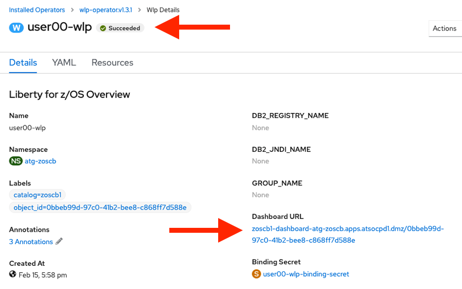
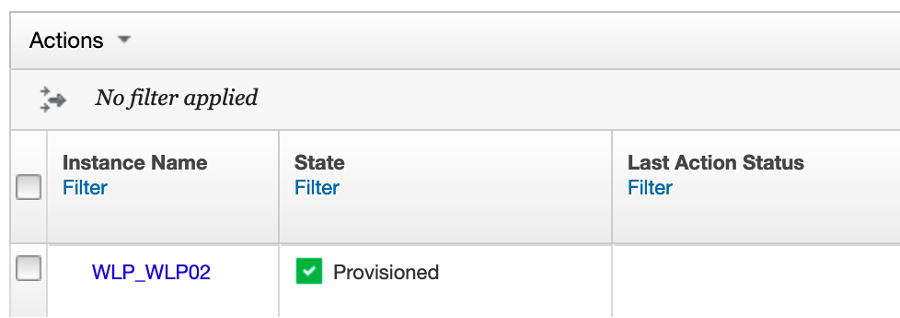
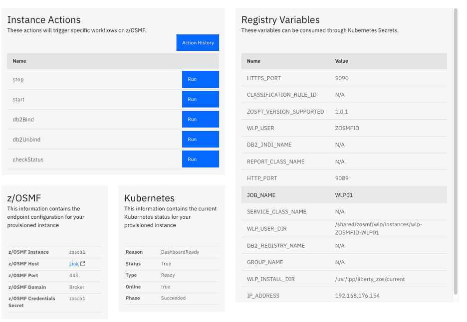

# Deploy Liberty for z/OS Using the z/OS Cloud Broker

With the z/OS Cloud Broker and OpenShift, provisioning z/OS resources is as easy as clicking on a tile in the OpenShift Developer Catalog.

1. **Enter the Developer Perspective**, if you aren’t there already.

1. **Make sure that you’re working under the z/OS Cloud Broker project `atg-zoscb`**.

    !!! Important ":warning: Important :warning:"
        ***Unlike other labs, this lab uses a shared project for all lab attendees. Please pay close attention to naming conventions so you do not end up deleting other attendees’ provisioned services***.

    

1. **Click the +Add button in the left-side menu**.

1. **Click the From Catalog tile**.

    

1. **Search the catalog for Liberty for z/OS** and **click on it**.

1. **Click the Create button** at the bottom of the page.

    !!! Information
        This Liberty service does not live inside this OpenShift cluster. It is, in fact, a template for a z/OS Liberty instance that z/OSMF has found and displayed. When you provision an instance, it will spin up the service in a completely different z/OS LPAR separate from the Linux LPAR where this OpenShift cluster is running.

1. All of the required fields will automatically populate for you, but **rename the wlp service to `userNN-wlp`** where `NN` is your user number.

    !!! Important ":warning: Important :warning:"
        Please double check that you have correctly typed your user number for userNN. Remember that you are using a shared project for this lab, and nothing is stopping you from interfering with another lab participant's provisioned service if you use the wrong name.

    

1. **Click the create button**.

    You will be brought to the *topology* page. After you click create, you will need to navigate to the *service instance* page:

1. **Switch to the Administrator Perspective -> Operators in the menu bar -> Installed Operators -> Liberty for z/OS -> Liberty for z/OS tab -> Click on the instance with your user number NN**.

    You will end up on a screen that looks like the following:

    

    Notice two things:

    * Depending on how quickly you navigated to this page and how long the WLP instance takes to provision, your status will be either *Pending* or *Succeeded*.

    * Once it’s *Succeeded*, you will have a link to your Dashboard.

    OpenShift is telling you that the service is either provisioned in z/OS, or in the process of being provisioned. While you don’t have access to z/OSMF, the following is what you would see over in the z/OSMF console:

    

    If you want to look at the z/OSMF console, ask an instructor and they will give you a tour.

    This service will take a minute or two to provision. Wait until you see the following messages on the service instance page:

    

    

    Over on z/OSMF page again, this is what one would see:

    

    And in z/OS itself, the following task is started:

    

    You have just successfully provisioned a Liberty instance on z/OS, without leaving the OpenShift console.

1. From the OpenShift WLP instance page, **click the Dashboard URL hyperlink**.

1. **Click the Log in with OpenShift button**.

1. You might get a security challenge here. If you do, **make sure that both of the two checkboxes are checked, and click Allow Selected Permissions**.

    You will be taken to the dashboard for your z/OS Liberty instance. This page will be referred to as the *Dashboard* tab.

    

    The right side of the page contains information about your WLP service and the z/OS system it’s running on.

    The left side of the page contains buttons you can use to perform various actions. You will use a few of them shortly.

1. **Scroll to the bottom of the right-hand column, and locate the `IP_ADDRESS` variable**.

    ??? Hint
        It's `192.168.176.154`. That’s the IP address of the z/OS system on which z/OSMF and Liberty for z/OS are hosted.

1. **Scroll up a bit and locate the `HTTP_PORT` variable**. It’s just about in the middle of the column.

    ??? Hint
        It's something like `9XXX`, where `XXX` will be unique for each user.

1. **Keeping the Dashboard tab open, open a new browser tab**.

1. **In the new tab, navigate to `<IP_ADDRESS>:<HTTP_PORT>`**

    ??? Hint
        It will look something like `192.168.176.154:9XXX`, where the `XXX` is unique for each user.

    You should see the default Liberty homepage. This is the Liberty service you just provisioned on z/OS.

    

1. Staying in this “Welcome to Liberty” tab, **add the following string to the end of the URL**: `/CloudTestServlet`

1. **Press enter**.

    That will take you to a sample application that was deployed into the Liberty z/OS instance you provisioned.  You will see something like this:

    

    Note the date and timestamp. It should be the current time (in U.S. Eastern time format).

1. **Reload the browser tab**.  You should see the time-stamp change.

    **Do not close this tab**.

1. **Return to the Dashboard tab**, which had all the information about the provisioned instance in it.
