# Application Observability with Kiali

*Kiali* provides visibility into your service mesh by showing you the microservices in your service mesh, and how they are connected.

Kiali provides an interactive graph view of your namespace in real time that provides visibility into features like circuit breakers, request rates, latency, and even graphs of traffic flows. Kiali offers insights about components at different levels, from Applications to Services and Workloads, and can display the interactions with contextual information and charts on the selected graph node or edge. Kiali also provides the ability to validate your Istio configurations, such as gateways, destination rules, virtual services, mesh policies, and more.

1. **Navigate to the Kiali console located at: <https://kiali-istio-system.apps.atsocpd2.dmz>**

1. **Log in with your OpenShift credentials**.

1. **View the overview of your mesh in the Overview page that appears immediately after you log in**.

    The Overview page displays all the namespaces that have services in the mesh.

    

    The namespaces shown are those previously discussed in the Service Mesh Member Roll.

## Validating Istio Configuration with Kiali

Kiali can validate your Istio resources to ensure they follow proper conventions and semantics. Any problems detected in the configuration of your Istio resources can be flagged as errors or warnings depending on the severity of the incorrect configuration.

You might have noticed on the Kiali overview page that there is an error somewhere within your userNN-project Istio configuration.

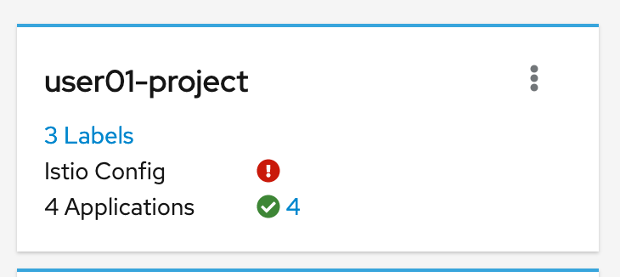

1. Let’s find and fix that error. **In the left-side menu of the Kiali console, navigate to Istio Config, and then filter to your userNN-project namespace**.

    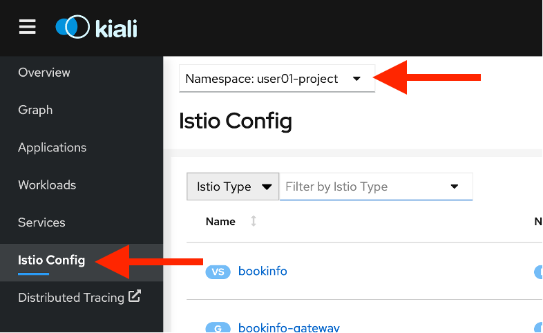

    You should notice an error icon in the Configuration column for your details microservice.

1. **Click the details hyperlink to drill down into the microservice and scroll to the bottom of the YAML file**.

    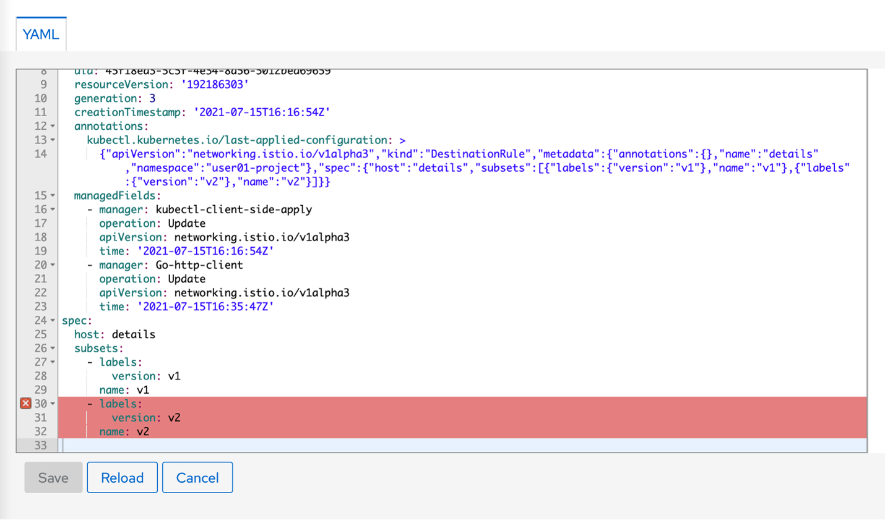

1. There is an error with v2 of the details DestinationRule. **For more specificity, hover over the red X to the left of the YAML file**.

    

    You will see the error code KIA0203 This subset’s labels are not found in any matching host. Essentially, the details DestinationRule is failing to find the v2 host for the details microservice.

    If you look back at our Bookinfo application architecture, there is only supposed to be one version of the details microservice - v1 is the only version that exists.

1. **Correct the error by deleting lines 30-32 of the YAML file, resulting in the following**:

    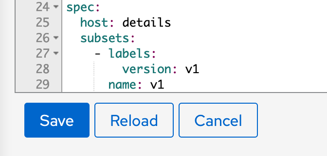

1. **Click on the Istio Config tab in the left-side menu again to navigate back to the configuration page for your project**.

    You should no longer have any configuration issues in your Istio configuration.

    

## Validating Service Mesh Application Configuration with Kiali

Along with identifying issues with the Istio configuration, Kiali can also identify issues with the *applications running on the Service Mesh*.

1. **In your terminal session, introduce an invalid configuration of a service port name with the following command**:

    ```bash
    oc patch service details --type json -p \
    '[{"op":"replace","path":"/spec/ports/0/name", "value":"foo"}]'
    ```

    ???+ example "Example Output"

        ```bash
        user01@lab061:~/istio-s390x$ oc patch service details --type json -p \
        > '[{"op":"replace","path":"/spec/ports/0/name", "value":"foo"}]'
        service/details patched

        ```

    If you see the `service/details patched` message as in the image above, your patch was successful.

1. Back in the Kiali web console, **navigate to the Services page from the left side menu**.

    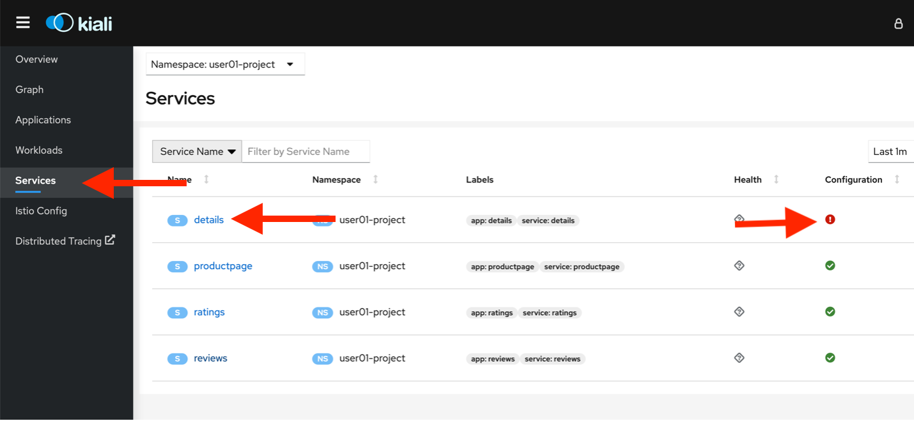

    You will notice that you now have an error icon under the Configuration column for the details service.

1. **Click the details hyperlink and then click the Network option under Service Info**.

    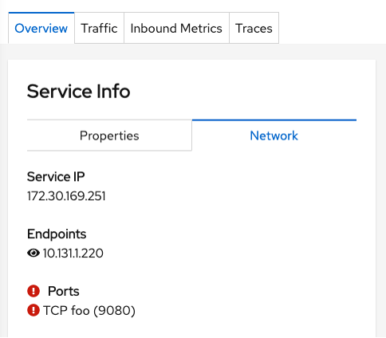

1. Hover over the error icon to display a tool tip describing the error.

    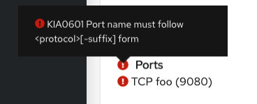

    This error is telling you that your port name does not follow the correct syntax.

1. **Back in your terminal session, run the following command to correct the port name**:

    ```bash
        oc patch service details--type json -p \
        '[{"op":"replace","path":"/spec/ports/0/name", "value":"http"}]'

    ```

    ???+ example "Example Output"

        ```bash
        user01@lab061:~/istio-s390x$ oc patch service details --type json -p \
        > '[{"op":"replace","path":"/spec/ports/0/name", "value":"http"}]'
        service/details patched

        ```

1. **Back in the Kiali console, click the blue refresh button and see that your error has been fixed**.

    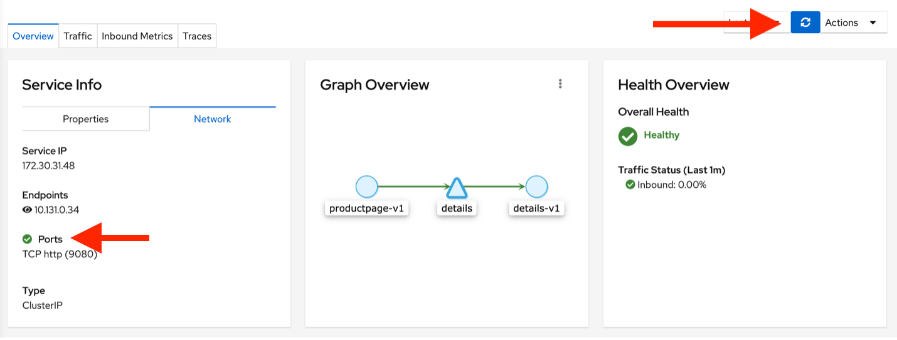

Now that our Service Mesh is configured correctly, along with the application running on top of it, let’s explore some of the other features that Kiali provides.

## Viewing Your Service Mesh Applications with Kiali

1. To view your namespace graph, **Select the Graph option in the left side menu and select your project in the namespace dropdown**. The page looks similar to:

    

    The graph represents traffic flowing through the service mesh for a period of time, generated using Istio telemetry.

1. Let’s generate some traffic into our Bookinfo application. **In your terminal session, run the following command to continually send http request to the productpage**:

    ```bash
    watch -n 1 curl -o /dev/null -s -w %{http_code} $GATEWAY_URL/productpage
    ```

    ???+ example "Example Output"

        ```bash
        user01@lab061:~/istio-s390x$ watch -n 1 curl -o /dev/null -s -w %{http_code} $GATEWAY_URL/productpage
        Every 1.0s: curl -o /dev/null -s -w %{http_code} user01-project.istio.apps.atsocpd2.dmz/productpage

        200

        ```

    If you see a 200 return code as in the image above, you’re now sending requests to the productpage every second.

    !!! Important ":warning: Important :warning:"
        Note: you will want to leave this watch command running until otherwise directed.

1. **Open a second terminal session and connect to the environment as directed previously in this lab**.

1. **To view a summary of metrics, select any node or edge in the graph to display its metric details in the summary details panel on the right**.

    For example, **click on the triangle representing the productpage service**, and you should see a 100% success rate for both inbound and outbound traffic.

    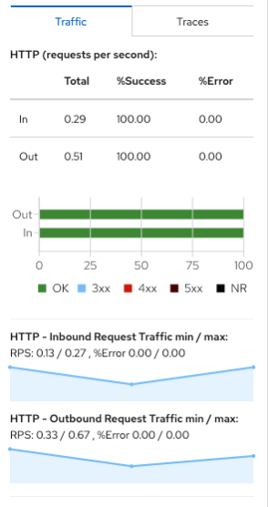

1. **On this same page, click the Display dropdown and select Requests Percentage and Service Nodes, if they aren’t already selected**.

    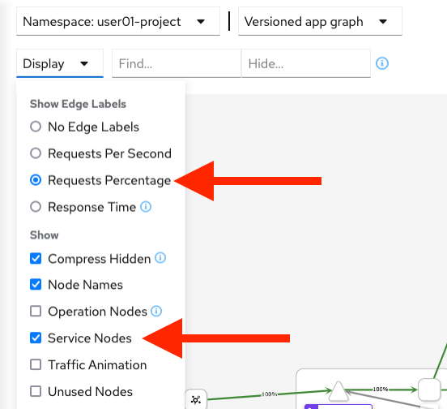

    This will let you view the percentage of traffic to each workload in near real-time. For example, since there are three versions of the reviews microservice and traffic is being distributed in a round-robin fashion, you should see close to 33% traffic going from the productpage to each version of reviews.

    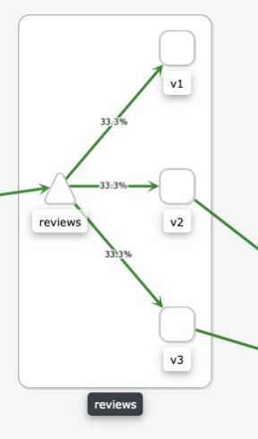

    Your percentages are likely not exactly 33.3%, as in the image above. More often, they will vary between 20% and 40%.

## Managing Service Mesh Applications with Kiali

Kiali does not only allow visibility into your service mesh application, Kiali can also be used to directly interact with the application.

1. **Click the reviews service represented by a triangle. In the right-side menu that pops up, click on the hyperlink for the reviews service**.

    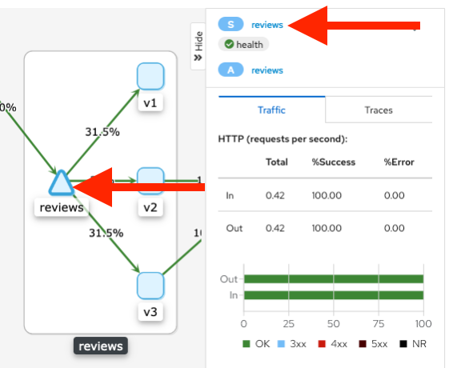

    You are taken to the Services page (instead of Graph, where you previously were). This shows expanded information about the reviews service, its properties and versions, metrics about its traffic, and more.

1. **Click the Actions dropdown in the top right of the page to see the traffic management options you have - Request Routing, Fault Injection, Traffic Shifting, and Request Timeouts**.

    These should all be grayed out right now because these are managed through DestinationRules, and we already created one for the reviews service in a previous step.

1. **Delete the Traffic Routing from this Actions dropdown and confirm that you want to delete the DestinationRule: ‘reviews’**.

    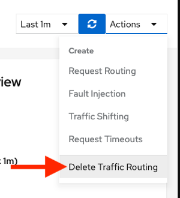

1. **Click the Actions dropdown again** and you will notice that the options can now be selected and **click the Traffic Shifting option**.

    

    From this page, you can create a new Traffic Shifting rule to manage how much traffic should be directed to each version of the reviews microservice.

1. **Slide the slider for reviews-v3 all the way to the left for 0%, and then make reviews-v1 and reviews-v2 50% and click create**. Your page should look like the image below.

    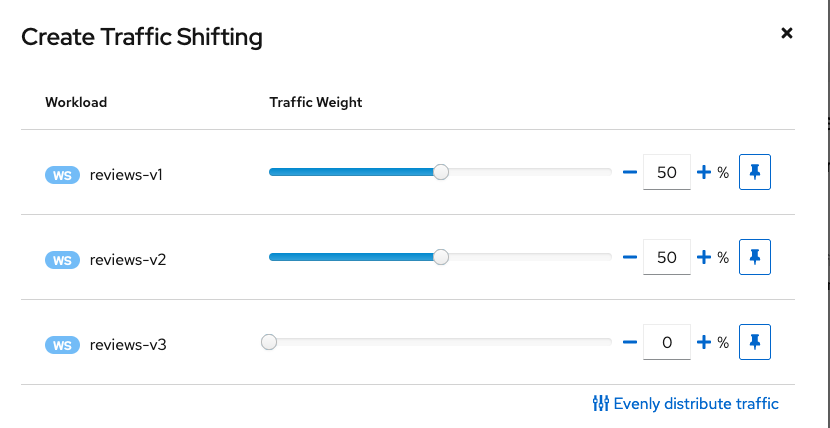

1. **Navigate back to the Graph page from the left side menu**.

    Over the next few minutes (and depending on the graph’s refresh rate that you can edit in the top right of the Graph page) you will see that the percentage of traffic going to v3 of reviews will decrease towards 0%, while the traffic going to v1 and v2 will increase towards 50%.

    

1. **In your web browser, navigate back to your bookinfo productpage and refresh the page a few times**.

    No matter how many times you refresh, you will not see the red stars again. That is because no traffic can reach v3 of the reviews microservice, which is the version that provides red stars.

As you can tell from the past few sections, you can control Service Mesh applications either from the Command Line by creating VirtualServices and DestinationRules, or by using the Kiali GUI console. Using the Kiali console simply generates the VirtualServices and DestinationRules for you, however the Command Line offers greater flexibility, more control, and the ability to automate the creation of these rules.

We will now move on from Kiali to Jaeger, the tool that OSSM uses for distributed tracing. At this point, feel free to explore Kiali and the other functions it provides. There are many things Kiali can do that we will not be covering in this lab. You can find more information in the Kiali documentation here: <https://kiali.io/documentation/latest/features/>
