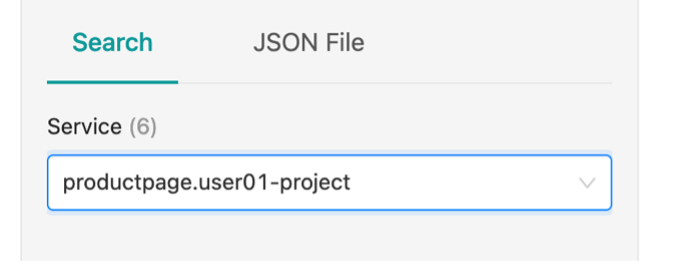
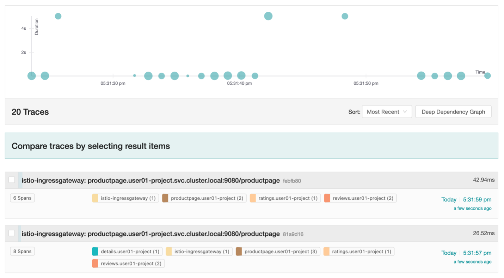
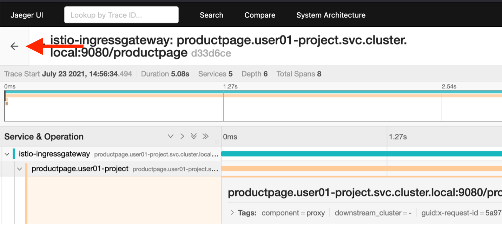
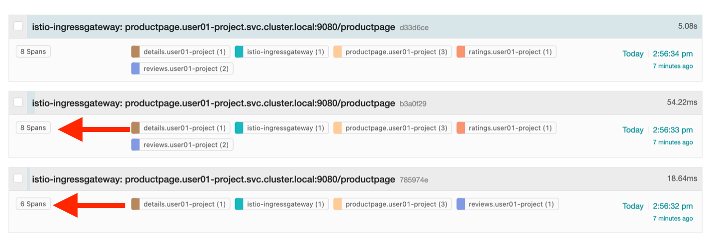
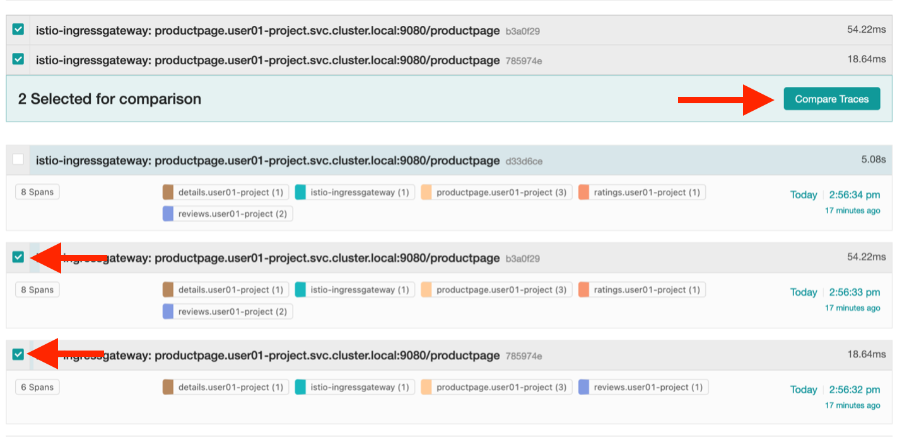

# Distributed Tracing with Jaeger

!!! Important
    Work In Progress

*Distributed Tracing* is the process of tracking the performance of individual microservices in an application by tracing the path of the service calls in the application. Each time a user takes action in an application, a request is executed that might require many microservices to interact to produce a response.

*Jaeger* is an open source distributed tracing system used by OpenShift Service Mesh. With Jaeger, you can perform a trace that follows the path of a request through various microservices which make up an application.

For our Bookinfo application, traces are generated when HTTP requests are made to the productpage microservice. This starts a cascade of requests to the other microservices in the Bookinfo mesh.

1. Before we start looking at traces, **check that your watch command is still running in your terminal session**.

    ???+ example "Example Output"

        ```bash
        Every 1.0s: curl -o /dev/null -s -w %{http_code} user01-project.istio.apps.atsocpd2.dmz/productpage

        200

        ```

    If you see the 200 status code return and the time in the top right is current, you are still sending requests to your productpage and will be able to generate traces.

    !!! Note
        If your watch command has been stopped for whatever reason, start it again with the command:

        ```bash
        watch -n 1 curl -o /dev/null -s -w %{http_code} $GATEWAY_URL/productpage
        ```
1. **Navigate to the Jaeger console located at: <https://jaeger-istio-system.apps.atsocpd2.dmz>**

1. **Login with your OpenShift credentials**.

    

1. **In the Service dropdown, select `productpage.userNN-project`**.

    If others are doing this same lab, it might be easier to search for your userNN-project.

    

1. **Scroll to the bottom-left of the page and click the Find Traces button**.

    

    The rest of the page will be populated by a graph of your traces over time, and the traces that meet your search criteria. You will notice that some of your traces have much longer durations than others - don’t worry about these. This is due to hard-coded http timeouts in the productpage python application code.

    The graph displayed at the top of the page has circles representing traces, with time on the x-axis and duration of the trace on the y-axis. The size of the circle represents how many spans make up the trace. A span is the logical unit of work associated with one microservice in the mesh.

    

1. **Click one of the traces in the list below the graph. Select a trace that has 8 spans, as described in the left side of the box**.

    

    You will be taken to a page that looks like the following:

    

    This graph shows how long each microservice took, when it started, when it ended, and includes detailed information about each span.

1. **Expand the span for your productpage, and then expand the Tags row**.

    

    Here you will find more information about the productpage span that may be helpful with debugging an application issue or latency.

1. **Click the back arrow in the top left of the page to navigate back to your project traces**.

    

    Jaeger includes a feature to compare two traces to one another.

1. In your list of traces, **find one trace that has 8 spans, and another that has 6 spans**.

    

1. **Click the checkboxes next to the names of the traces, and then Compare Traces to the top right of the traces list**.

    

    The resulting page shows the microservices that exist in trace A, trace B, and both traces you selected.

    

    Your comparison will likely look different. Any gray nodes are microservices that exist in both traces at the same version. Any red nodes exist in Trace A, but not Trace B. Any green nodes exist in Trace B, but not Trace A. If you’re comparing the Traces in the screenshot above, you can discern that the ratings microservice is not being called in Trace B, and that the versions of the reviews microservices are different in the two traces.

???+ Note
    The distributed tracing sampling rate is set to sample 100% of traces in your Service Mesh by default. A high sampling rate consumes cluster resources and performance but is useful when debugging issues. Before you deploy Red Hat OpenShift Service Mesh in production, you would want to set the value to a smaller proportion of traces.
